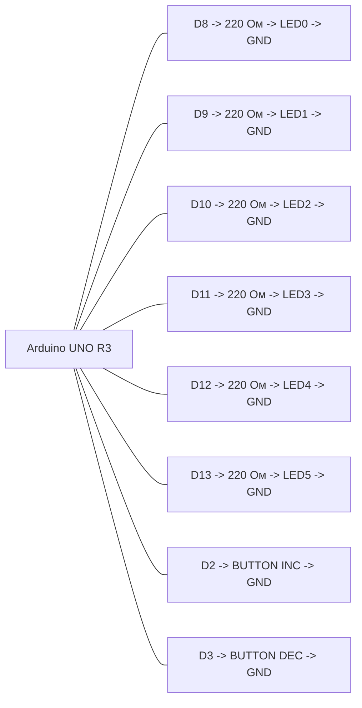

# ЛР1, вариант 1

## Задача

Вывод 6-битного числа на светодиодную линейку через `Port B`, инкремент и декремент по кнопкам.

## Компоненты Proteus

- `ARDUINO UNO R3`
- `LED-RED` x6
- `RES` x6, номинал `220 Ом`
- `BUTTON` x2
- `GROUND`

## HEX

- `../proteus/lab1_variant1/lab1_variant1.hex`

## Соединения

| Компонент | Подключение |
|---|---|
| LED0 | D8 через 220 Ом |
| LED1 | D9 через 220 Ом |
| LED2 | D10 через 220 Ом |
| LED3 | D11 через 220 Ом |
| LED4 | D12 через 220 Ом |
| LED5 | D13 через 220 Ом |
| Кнопка INC | D2 -> кнопка -> GND |
| Кнопка DEC | D3 -> кнопка -> GND |
| Все катоды светодиодов | GND |

## Mermaid-схема

## Что делать в Proteus

1. Разместите Arduino Uno и 6 светодиодов.
2. Подключите `D8-D13` к светодиодам через резисторы `220 Ом`.
3. Подключите две кнопки к `D2` и `D3`, второй вывод каждой кнопки на `GND`.
4. Откройте свойства Arduino и укажите файл `lab1_variant1.hex`.
5. Нажмите `Play`.

## Что проверять

- Кнопка на `D2` увеличивает число.
- Кнопка на `D3` уменьшает число.
- Значение ограничено диапазоном `0..63`.
