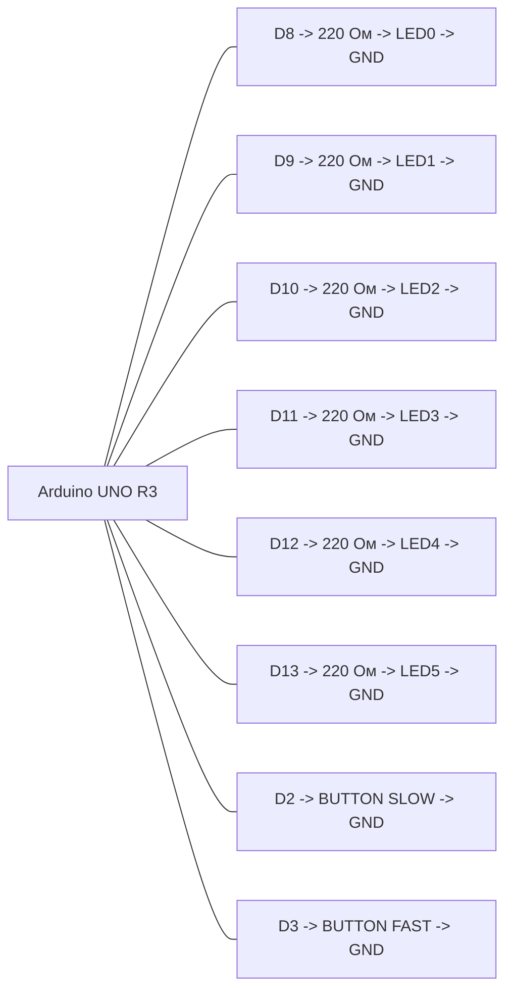

# ЛР1, вариант 2

## Задача

Бегущий огонь на 6 светодиодах. Кнопка на `D2` замедляет, кнопка на `D3` ускоряет.

## Компоненты Proteus

- `ARDUINO UNO R3`
- `LED-RED` x6
- `RES` x6, номинал `220 Ом`
- `BUTTON` x2
- `GROUND`

## HEX

- `../proteus/lab1_variant2/lab1_variant2.hex`

## Соединения

| Компонент | Подключение |
|---|---|
| LED0 | D8 через 220 Ом |
| LED1 | D9 через 220 Ом |
| LED2 | D10 через 220 Ом |
| LED3 | D11 через 220 Ом |
| LED4 | D12 через 220 Ом |
| LED5 | D13 через 220 Ом |
| Кнопка SLOW | D2 -> кнопка -> GND |
| Кнопка FAST | D3 -> кнопка -> GND |
| Все катоды светодиодов | GND |

## Mermaid-схема

## Что делать в Proteus

1. Добавьте Arduino Uno, 6 светодиодов, 6 резисторов и 2 кнопки.
2. Подключите светодиоды к `D8-D13`.
3. Подключите кнопки к `D2` и `D3`.
4. В свойствах Arduino укажите `lab1_variant2.hex`.
5. Запустите симуляцию.

## Что проверять

- Один светодиод движется по линейке.
- Кнопка `D2` уменьшает скорость движения.
- Кнопка `D3` увеличивает скорость движения.
