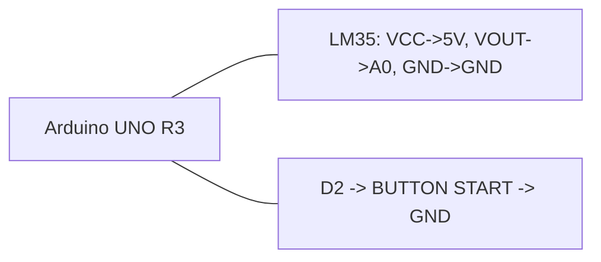

# ЛР2, вариант 1

## Задача

Считывание температуры с `LM35`, запуск выборки кнопкой, сохранение массива результатов.

## Компоненты Proteus

- `ARDUINO UNO R3`
- `LM35DZ`
- `BUTTON`
- `GROUND`
- `+5V`
- при желании `VIRTUAL TERMINAL` для отладочного вывода

## HEX

- `../proteus/lab2_variant1/lab2_variant1.hex`

## Соединения

| Компонент | Подключение |
|---|---|
| LM35 VCC | 5V |
| LM35 VOUT | A0 |
| LM35 GND | GND |
| Кнопка START | D2 -> кнопка -> GND |

## Mermaid-схема

## Что делать в Proteus

1. Добавьте Arduino Uno и датчик `LM35DZ`.
2. Подключите выход датчика к `A0`.
3. Подключите кнопку к `D2`.
4. Укажите `lab2_variant1.hex` в `Program File`.
5. Запустите симуляцию.

## Что проверять

- При нажатии на кнопку стартует выборка.
- Значения температуры обрабатываются внутри программы.
