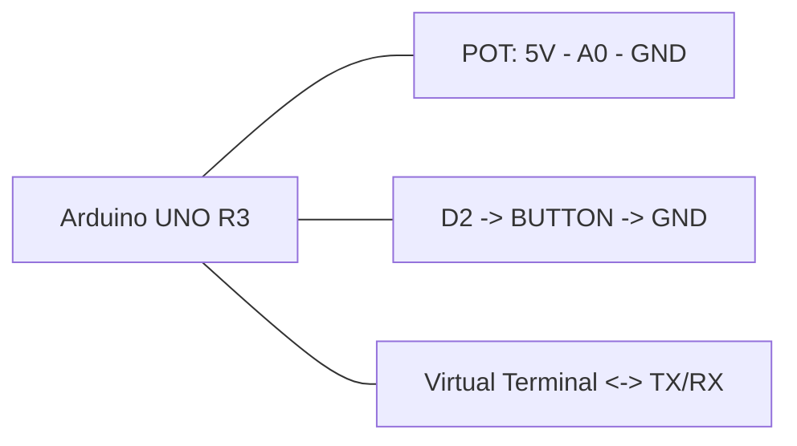

# ЛР2, вариант 2

## Задача

Считывание потенциометра по кнопке с антидребезгом, вычисление среднего и стандартного отклонения.

## Компоненты Proteus

- `ARDUINO UNO R3`
- `POT-HG` или любой потенциометр
- `BUTTON`
- `VIRTUAL TERMINAL`
- `GROUND`

## HEX

- `../proteus/lab2_variant2/lab2_variant2.hex`

## Соединения

| Компонент | Подключение |
|---|---|
| Потенциометр вывод 1 | 5V |
| Потенциометр вывод 2 | GND |
| Потенциометр движок | A0 |
| Кнопка измерения | D2 -> кнопка -> GND |
| Virtual Terminal RX | TX Arduino (D1) |
| Virtual Terminal TX | RX Arduino (D0), опционально |
| Общая земля | GND |

## Mermaid-схема

## Что делать в Proteus

1. Добавьте Arduino Uno, потенциометр, кнопку и `Virtual Terminal`.
2. Подключите потенциометр к `A0`.
3. Подключите кнопку к `D2`.
4. Подключите `TX` Arduino к `RX` Virtual Terminal.
5. Укажите `lab2_variant2.hex`.
6. Запустите симуляцию.

## Что проверять

- Поворачивайте потенциометр.
- Нажимайте кнопку измерения.
- В терминале должны выводиться результаты и статистика.
