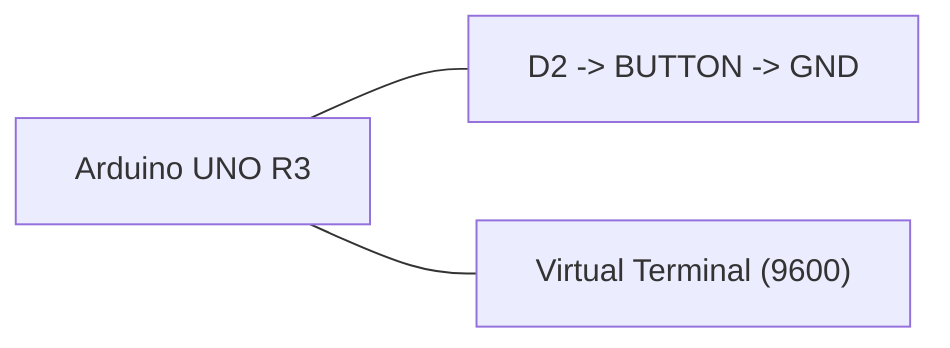

# ЛР3, CRC-8, версия со сбросом

## Задача

Подсчет CRC-8 по UART, выдача результата кнопкой, после выдачи CRC сбрасывается.

## Компоненты Proteus

- `ARDUINO UNO R3`
- `BUTTON`
- `VIRTUAL TERMINAL`
- `GROUND`

## HEX

- `../proteus/lab3_crc8_reset/lab3_crc8_reset.hex`

## Соединения

| Компонент | Подключение |
|---|---|
| Кнопка | D2 -> кнопка -> GND |
| Virtual Terminal RX | TX Arduino (D1) |
| Virtual Terminal TX | RX Arduino (D0) |
| Скорость | 9600 бод |

## Mermaid-схема

## Что делать в Proteus

1. Добавьте Arduino Uno, кнопку и `Virtual Terminal`.
2. Соедините `D0/D1` Arduino с терминалом.
3. Подключите кнопку к `D2`.
4. Укажите `lab3_crc8_reset.hex`.
5. В терминале поставьте `9600`.
6. Отправляйте символы без `CR/LF`, если терминал это поддерживает.

## Что проверять

- Отправьте `A`, затем нажмите кнопку.
- После выдачи CRC аккумулятор должен сброситься.
