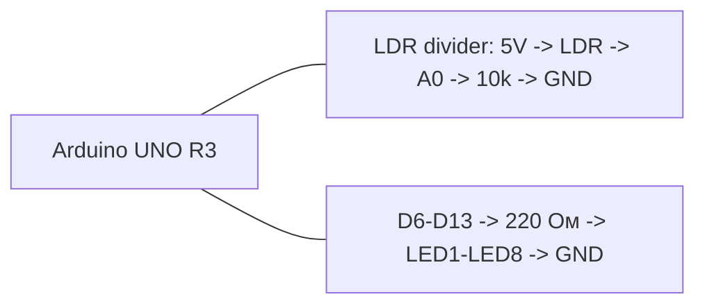

# ЛР4, вариант 2

## Задача

Индикатор освещенности: количество включенных светодиодов зависит от сигнала на `A0`.

## Компоненты Proteus

- `ARDUINO UNO R3`
- `LDR`
- `RES` x9
- 1 резистор `10 кОм`
- 8 резисторов `220 Ом`
- `LED-RED` x8
- `GROUND`
- `+5V`

## HEX

- `../proteus/lab4_variant2/lab4_variant2.hex`

## Соединения

| Компонент | Подключение |
|---|---|
| LDR | 5V -> LDR -> A0 |
| Резистор 10 кОм | A0 -> GND |
| LED1 | D6 через 220 Ом |
| LED2 | D7 через 220 Ом |
| LED3 | D8 через 220 Ом |
| LED4 | D9 через 220 Ом |
| LED5 | D10 через 220 Ом |
| LED6 | D11 через 220 Ом |
| LED7 | D12 через 220 Ом |
| LED8 | D13 через 220 Ом |
| Катоды светодиодов | GND |

## Mermaid-схема

## Что делать в Proteus

1. Добавьте Arduino Uno, `LDR`, резистор `10 кОм` и 8 светодиодов.
2. Соберите делитель для `A0`.
3. Подключите светодиоды к `D6-D13`.
4. Укажите `lab4_variant2.hex`.
5. Запустите симуляцию.

## Что проверять

- При изменении освещенности `LDR` число включенных светодиодов должно меняться.
